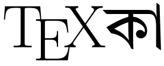
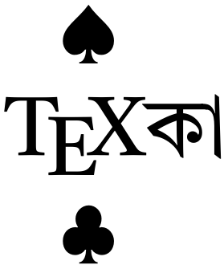
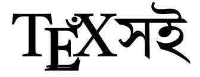
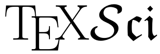
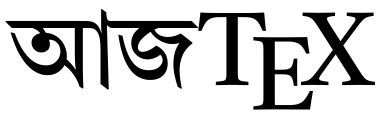

# TeXচাঁদ

XeLaTeX-based template for scientific and literary publication in Bengali vernacular compatible modern printing technology and readership. Named after one of the earliest Bengali prose authors post-medieval era, who is more famous in his pseudonym টেকচাঁদ ঠাকুুর; the codes have the following variant (mutually exhaustive, but not alternative) packages:

 

means ‘ace’ in bridge, and is derived from TeX(patri)ka. It is a template designed for newspaper and literary magazine, adapting the traditional styles of enigmatic journals of the era of Kazi Nazrul’s Dhumketu into a new digital era of color printing and PDF readers. Runs on XeTeX and ideally uses fonts Alkatra for headings, Tiro Bangla for Bengali and Latin Texts.

 

Referring in Bengali to its durability, the idea is to make the perfect professional mathematical typesetting in the latest AMS-approved style go hand-in-hand with the standard elegant Bengali typefaces in perfect blend with math mode. Uses STIX and Tiro Bangla with amsart.

pronounced as ‘az-tec’

The perfect typesetting for books of fiction and essays, letters and notices, merging the Times Roman font with the metal Bengali typefaces predating the old Linotype digitized with the new computer-compatibility of the new Linotype. Uses Tiro Bangla, STIX and classy book jacket designs from elite libraries.

pronounced as ‘tech-nickel’

The perfect typesetting for books of fiction and essays and even science (by that I don't just mean popular science!), merging the Times Roman font with the metal Bengali typefaces predating the old Linotype digitized with the new computer-compatibility of the new Linotype. Uses Tiro Bangla, STIX and classy book jacket designs from elite libraries. You can prepare formés for easy printing according to your available raw paper size. Book jacket designs and templates come along.

___

For mathematical typesetting, we opt for STIX here as do journals such as Acta Arithmetica. We adopt for the Bengali script, Tiro Bangla (part of Tiro Typework’s project Indigo). A suggested input engine for preparing Bengali unicode text by the same author is ibus-table-sasanka.

This is a relatively new technology in the Bengali literature industry: the layout-settings and designs are mostly optimized and automatic, to be compiled with XeLaTeX. Resultant codes have been successfully compiled with texlive-full. It’s platform independent for compilation, and rendering new editions or modifications is hassle-free. E-books and print copies can be printed together from the same typesetting format, with adaptations relevant to the respective environment. Plus, it will get us a step forward in being ready to publish scientific works in international standards like it’s done in Chinese or Farsi. Still, we’ve kept the layouts as much traditional as possible (remembering our aesthetic literary heritage), only making it more fit in the new millenium’s standards of publishing. In the long run, we hope the book industry will be largely benefitted.

Derivatve works for other languages is just a triviality and is essentially a matter of curating the fonts.

___

Designed and maintained by Anamitro Biswas (website: https://sites.google.com/view/anamitro), mathematician by profession and enthusiastic in Sanskrita-Bengali literature and typography. For any queries or feedback, you may drop an email at: anamitroappu@gmail.com.

Licensing information:

Copyright (C) Anamitro Biswas 2024.

The codes, logo etc. of constituents of Project TeXচাঁদ are intellectual properties of the author and might not be used or replicated elsewhere without explicit permission, except for the parts specifically mentioned to be under LPPL, in which case the source and the author must be acknowledged.
